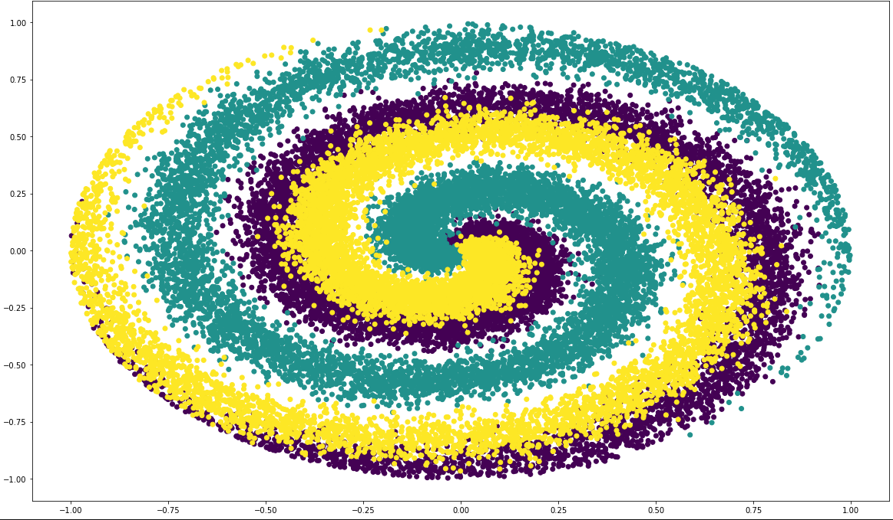

# Neural Network from Scratch Implementation

In this repository, with only `numpy` as only dependency, I have implemented a neural network from scratch based on this marvelous book:
[nnfs.io](https://nnfs.io/).




## Installation

```bash
python3.9 -m pip install nnfs-implementation;
```
P.S.: This package is compatible with python3.9+.

## Examples
There is [a module](nnfs/examples.py) with some examples in the repository, but since this package is use the `nnfs` name internally,
**it will have a name collision** with the original [nnfs package](https://pypi.org/project/nnfs/) which provides the toy datasets, and you cannot run it. although a glance on it doesn't hurt.
Also, There is this notebook [VanillaNN.ipynb](VanillaNN.ipynb) which is the full implementation will all the examples and some nice plots at the bottom. I highly recommend you to take a look at it.

## Instructions
A simple multi-class classifier can be implemented with the following code:

```python
model = Model(loss=SoftmaxLoss(), optimizer=Adam(), metric=Accuracy())
model.add(Layer(28 * 28, 512))
model.add(ReLU())
model.add(Layer(512, 10))
model.fit(train_images, train_labels, epochs=10, batch_size=512)
validation_accuracy = Accuracy.evaluate(test_labels, model.predict(test_images))
print(f"Validation Accuracy: {validation_accuracy:.2%}")
```

### Model
For defining the main model, you should use this pattern:
```python
from nnfs.loss import SoftmaxLoss
from nnfs.metrics import Accuracy
from nnfs.model import Model
from nnfs.optimizers import Adam

model = Model(loss=SoftmaxLoss(), optimizer=Adam(), metric=Accuracy())
```

You have to define the loss function, the optimizer, and the metric. For any of these components you can change the default values like this:

```python
model = Model(loss=SoftmaxLoss(), optimizer=Adam(learning_rate=0.001), metric=Accuracy())
```

### Loss Criterion
The loss criterion is the function that will be used to calculate the loss of the model. 
nnfs-implementation provides four loss criterion: (but none of them support multi-label classification):

```python
from nnfs.loss import BinaryLoss, CategoricalLoss, MSELoss, SoftmaxLoss
```

#### BinaryLoss
Binary cross-entropy loss, you must use a single neuron with a sigmoid activation function for the last layer. (CLASSIFICATION)

#### CategoricalLoss
Categorical cross-entropy loss, you can use it with combination of multiple neurons with a softmax activation function for the last layer. 
**BE AWARE that backpropagation of softmax and CategoricalLoss is inefficient and expensive, so it's HIGHLY recommended to use SoftmaxLoss instead.** (CLASSIFICATION)

#### MSELoss
Mean squared error loss. (REGRESSION)

#### SoftmaxLoss
Softmax activation layer combined with categorical cross-entropy loss.
The derivatives of combining these two layers is computationally a lot cheaper than processing each one separately;
so we merge them into one layer. **THERE IS NO NEED TO USE A SOFTMAX AT LAST LAYER ANYMORE.** (CLASSIFICATION)

### Optimizers
We can take advantage of two optimizers; Momentum and Adam. Adam is superior to Momentum in most cases.

```python
from nnfs.optimizers import Adam, Momentum

adam = Adam(learning_rate=0.01, decay=1e-5, beta_1=0.9, beta_2=0.999)  # Default Values
momentum = Momentum(learning_rate=0.01, decay=1e-5, beta=0.1) # Default Values
model = Model(loss=SoftmaxLoss(), optimizer=adam, metric=Accuracy())
```

You must play around with the parameters of the optimizer to find the best one for your model.
decay is the learning rate decay.

### Metrics
We have 5 metrics which we use during training and evaluation phase.
```python
from nnfs.metrics import Accuracy, ExplainedVariance, FScore, Precision, Recall

model = Model(loss=SoftmaxLoss(), optimizer=adam, metric=Accuracy())
validation_metric = ExplainedVariance.evaluate(y_test, model.predict(X_test))
```
ExplainedVariance is for regression tasks, all the others are for classifications.
**Precision, Recall and FScore are calculated by Macro averaging.**

### Layers
We provide FullyConnectedLayer and DropoutLayer.

```python
from nnfs.layer import Dropout, Layer

model.add(Layer(64, 128)) # FullyConnectedLayer with 64 inputs and 128 outputs.
model.add(Dropout(0.2)) # DropoutLayer with 20% dropout.
model.add(Layer(2, 64, w_l2=5e-4, b_l2=5e-4)) # FullyConnectedLayer with L2 regularization. (weight and bias)
model.add(Layer(2, 64, w_l2=5e-4, b_l2=5e-4, w_l1=5e-4, b_l1=5e-4)) # FullyConnectedLayer with L1 and L2 regularization. (weight and bias)
```

### Activation Functions
nnfs-implementation provides six activation functions:

```python
from nnfs.activations import LeakyReLU, Linear, ReLU, Sigmoid, Softmax, TanH

model.add(ReLU())
model.add(LeakyReLU(negative_slope=0.1))
```
Linear should be used for regression in the last layer. 

### Training
```python
model.fit(X_train, y_train, epochs=1_000, batch_size=None, shuffle=True)  # Default Values
model.fit(X_train, y_train, epochs=20, batch_size=512, shuffle=True) 
```
If batch_size is None, then the whole dataset will be used.

### Prediction
```python
y_pred = model.predict(X_test)
y_pred_proba = model.predict_proba(X_test)
```

### Loading & Saving
To load a model, simply use:
```python
from nnfs.model import Model

model = Model.load("model.pkl")
```
and to save the model:
```python
model.save("model.pkl", cleanup=True)
```
cleanup option will remove some unnecessary attributes that leads to dramatically reduced saved model size.
default value is True.


## Caution
**This project is only for demonstration purpose.** It works on numpy arrays (CPU) so you will face a poor performance.


## Contributing
Pull requests are welcome. For major changes, please open an issue first to discuss what you would like to change.

Contact me: <OSS@Mahyar24.com> :)

## License
[GNU GPLv3](https://choosealicense.com/licenses/gpl-3.0/)
